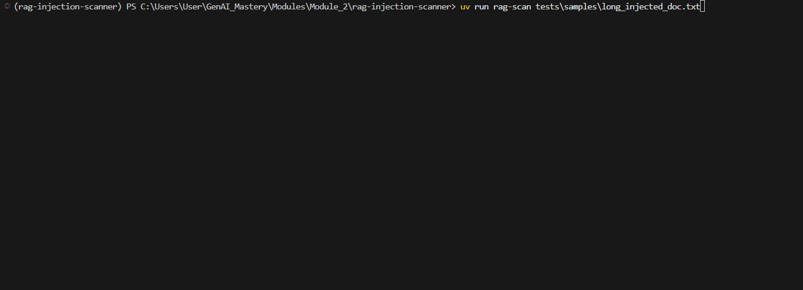

<div align="center">

# RAG Injection Scanner

**Detect prompt injection payloads in documents before they enter your RAG vector store.**

[](https://www.python.org/downloads/)
[](https://opensource.org/licenses/MIT)
[]()
[](https://owasp.org/www-project-top-10-for-large-language-model-applications/)

</div>

---

## Table of Contents

- [Why This Exists](#why-this-exists)
- [How It Works](#how-it-works)
- [Results](#results)
- [Quick Start](#quick-start)
- [Installation](#installation)
- [Usage](#usage)
- [Exit Codes](#exit-codes)
- [Supported File Types](#supported-file-types)
- [Architecture](#architecture)
- [Test Suite](#test-suite)
- [Known Limitations](#known-limitations)
- [Roadmap](#roadmap)
- [Contributing](#contributing)
- [License](#license)

---

## Why This Exists

Prompt injection against RAG systems is not a theoretical risk —
it is the **#1 vulnerability in the OWASP LLM Top 10** as of 2025/2026,
actively exploited in production systems worldwide.

**The numbers:**
- 53% of companies now run RAG or agentic pipelines (OWASP 2025)
- 5 poisoned documents can manipulate a RAG system 90% of the time
  (PoisonedRAG, USENIX Security 2025)
- 90+ organizations hit by prompt injection attacks in 2026
  (CrowdStrike Global Threat Report 2026)
- $18M in prevented losses at one bank after deploying injection
  defenses (industry case study, 2025)
- 83% of organizations plan agentic AI deployment — only 29% feel
  ready to secure it (Cisco State of AI Security 2026)

**Real production incidents this tool addresses:**
- **CVE-2025-32711** (EchoLeak, CVSS 9.3) — poisoned document
  exfiltrated sensitive data without any user interaction
- **CVE-2025-53773** (GitHub Copilot, CVSS 9.6) — injection in public
  repository comments led to remote code execution
- **ServiceNow Now Assist** (late 2025) — second-order injection caused
  a low-privilege agent to trick a high-privilege agent into exporting
  case files to an external URL

The attack surface is expanding as AI agents gain tool access. A
successful injection no longer just leaks text — it executes code,
calls APIs, and moves laterally through systems.

**No pip-installable pre-ingestion scanner existed for this problem.
This fills that gap.**

---

## How It Works
```
Document → Chunker → Layer 1 → Layer 2 → Layer 3 → Risk Report
                     Regex     Heuristic  LLM Judge
                     (free)    (free)     (flagged chunks only)
```

**Three detection layers, each catching what the previous missed:**

**Layer 1 — Regex Scanner** `free · ~1ms/chunk`
Detects known explicit patterns across 7 attack categories: instruction
overrides, role switching, system prompt markers, imperative commands,
data exfiltration attempts, obfuscation signals, and developer/god mode
jailbreaks. 40+ compiled patterns with case-insensitive matching.

**Layer 2 — Heuristic Scorer** `free · ~10ms/chunk`
NLP-based scoring using 6 linguistic signals: instruction verb density,
imperative sentence concentration, second-person pronoun density,
contextual mismatch, sentence length uniformity, and question ratio.
Catches paraphrased attacks that use no flagged keywords. Powered by spaCy.

**Layer 3 — LLM Judge** `paid · flagged chunks only`
Sends only suspicious chunks to an LLM with an XML-isolated prompt that
prevents the payload itself from influencing the judge's reasoning.
Returns DATA or INSTRUCTION with confidence score and plain-English
reasoning. **89% of chunks never reach this layer in typical scans.**

**Risk Classifier**
Combines all three layer signals into a final verdict per chunk:
`CLEAN`, `SUSPICIOUS`, or `DANGEROUS`. High-confidence Layer 3 DATA
classifications override Layer 1 pattern matches — preventing false
positives on legitimate security documentation or technical content.

---

## Results

Tested against 7 documents (42 total chunks):

| Document | Chunks | Result | False Positives |
|---|---|---|---|
| Wikipedia: Machine Learning | 11 | ✅ CLEAN | 0 |
| Wikipedia: Neural Networks | 11 | ✅ CLEAN | 0 |
| Technical ML document | 9 | ✅ CLEAN | 0 |
| Short clean document | 1 | ✅ CLEAN | 0 |
| Explicit injection document | 1 | 🚨 DANGEROUS ✓ | — |
| 10-para compliance doc, injection buried in para 6 | 7 | 🚨 DANGEROUS (chunk 3 only) ✓ | 0 |
| Simulated poisoned policy document | 2 | 🚨 DANGEROUS (chunk 0 only) ✓ | 0 |

**Key result:** 4 lines of injection hidden inside a 10-paragraph GDPR
compliance document. Scanner identified exactly 1 dangerous chunk out
of 7. **Zero false positives** on surrounding legitimate legal content.

**Cost efficiency:** 89% of chunks never reached the LLM judge —
Layer 1 and Layer 2 handled the rest for free.

---

## Quick Start
```bash
git clone https://github.com/azhwinraj/rag-injection-scanner.git
cd rag-injection-scanner
uv sync
echo "GROQ_API_KEY=your_key_here" >> .env
uv run rag-scan document.pdf
```

Get a free Groq API key at [console.groq.com](https://console.groq.com)



---

## Installation

**Requirements:** Python 3.11+, [uv](https://docs.astral.sh/uv/)
```bash
# Clone the repository
git clone https://github.com/azhwinraj/rag-injection-scanner.git
cd rag-injection-scanner

# Install dependencies
uv sync

# Configure environment
cp .env.example .env
# Edit .env and add your GROQ_API_KEY
```

**Troubleshooting:**

If you see `spaCy model not found`:
```bash
uv add https://github.com/explosion/spacy-models/releases/download/en_core_web_sm-3.8.0/en_core_web_sm-3.8.0-py3-none-any.whl
```

If you see `rag-scan: command not found`:
```bash
uv pip install -e .
```

---

## Usage
```bash
# Scan a single file
uv run rag-scan document.pdf

# Scan a directory
uv run rag-scan ./docs/

# Save JSON report
uv run rag-scan ./docs/ --output reports/scan.json

# Strict mode — fail on SUSPICIOUS too (recommended for CI/CD)
uv run rag-scan ./docs/ --strict

# Verbose — see all layer decisions
uv run rag-scan document.pdf --verbose
```

**Sample output:**
```
╭─────────────────────── Scan Report ───────────────────────╮
│ RAG Injection Scanner                                      │
│ Source: policy_document.pdf                                │
│ Overall Risk: DANGEROUS                                    │
╰────────────────────────────────────────────────────────────╯
  Total chunks   7
  Clean          6
  Suspicious     0
  Dangerous      1

Flagged Chunks (1):
  Chunk  Risk       L1  L2     L3              Reason
  3      DANGEROUS  ✓   0.472  INSTRUCTION     Layer 3 classified as
                               0.90            INSTRUCTION...
```

---

## Exit Codes

Designed for CI/CD pipeline integration:

| Code | Meaning |
|---|---|
| `0` | All chunks clean |
| `1` | At least one suspicious chunk |
| `2` | At least one dangerous chunk |

**GitHub Actions example:**
```yaml
- name: Scan knowledge base before ingestion
  run: uv run rag-scan ./knowledge_base/ --strict
  # Pipeline fails automatically on suspicious or dangerous content
```

---

## Supported File Types

| Format | Parser |
|---|---|
| `.txt`, `.md` | Built-in Python |
| `.pdf` | pdfplumber |
| `.html` | BeautifulSoup4 |

---

## Architecture
```
src/rag_scanner/
├── chunker.py          # 512-char overlapping chunks with metadata
├── layer1_regex.py     # 40+ compiled regex patterns, 7 attack categories
├── layer2_heuristic.py # 6 NLP signals via spaCy en_core_web_sm
├── layer3_llm.py       # LLM judge, XML-isolated prompt, Groq/Anthropic
├── classifier.py       # Multi-signal risk decision engine
├── reporter.py         # Rich terminal output + JSON reports
└── cli.py              # Click-based CLI, file + directory scanning
```

**Risk classification decision tree:**
```
Layer 3 ran?
├── INSTRUCTION classification          → DANGEROUS
├── UNCERTAIN or confidence < 0.70      → SUSPICIOUS
└── DATA + confidence ≥ 0.90            → CLEAN
    └── DATA + confidence 0.70–0.89
        ├── Layer 1 also flagged        → SUSPICIOUS (conflicting)
        └── No other flags              → CLEAN

Layer 3 skipped?
├── Layer 1 flagged OR Layer 2 ≥ 0.40  → SUSPICIOUS
└── Neither                             → CLEAN
```

---

## Test Suite
```bash
uv run pytest tests/ -v
# 59 tests · 0 failures · 2.0s
```

| Module | Tests | Coverage |
|---|---|---|
| Chunker | 14 | Edge cases, overlap, guard clauses |
| Layer 1 | 16 | All 7 attack categories, false positives, batch |
| Layer 2 | 13 | All 6 signals, threshold, batch |
| Classifier | 16 | All decision paths, conflicting signals |

---

## Known Limitations

**Obfuscated attacks:** Base64 encoding, unicode lookalikes, and character
substitution may partially evade Layer 1. Layer 2 and Layer 3 provide
coverage but a dedicated obfuscation pre-processor is not in v1.

**Cross-chunk attacks:** Payloads deliberately split across chunk
boundaries reduce detection confidence. The 50-character overlap
mitigates this but does not eliminate it.

**English only:** Patterns and NLP models are English-only. Multilingual
injection attacks are not detected in v1.

**No formal benchmark:** No labeled benchmark exists specifically for
pre-ingestion indirect injection detection. v1 is validated against
manually crafted test documents and real Wikipedia articles. A formal
benchmark is on the roadmap.

---

## Roadmap

- [ ] Formal benchmark using deepset/prompt-injections adapted for
      indirect injection scenarios — precision/recall/F1
- [ ] Embedding-based anomaly detection as Layer 2.5
- [ ] Obfuscation pre-processor (Base64, unicode normalization)
- [ ] Cross-chunk context window in Layer 3
- [ ] DOCX and CSV file format support
- [ ] Multilingual pattern support
- [ ] Anthropic Claude as alternative Layer 3 provider

---

## Contributing

Contributions are welcome. To get started:
```bash
git clone https://github.com/azhwinraj/rag-injection-scanner.git
cd rag-injection-scanner
uv sync
uv run pytest tests/ -v  # make sure all 59 tests pass
```

Please open an issue before submitting a PR for significant changes.
All PRs must include tests and pass the existing test suite.

---

## License

MIT — see [LICENSE](LICENSE) for details.

---

## References

- [OWASP LLM Top 10 2025](https://owasp.org/www-project-top-10-for-large-language-model-applications/)
  — LLM01: Prompt Injection, LLM08: Vector and Embedding Weaknesses
- [PoisonedRAG](https://github.com/sleeepeer/PoisonedRAG)
  — Knowledge Corruption Attacks to RAG Systems (USENIX Security 2025)
- [CVE-2025-32711](https://msrc.microsoft.com/update-guide/vulnerability/CVE-2025-32711)
  — EchoLeak (CVSS 9.3)
- [CVE-2025-53773](https://github.com/advisories/GHSA-x7m7-7wg6-8xh8)
  — GitHub Copilot RCE (CVSS 9.6)
- [CrowdStrike Global Threat Report 2026](https://www.crowdstrike.com/global-threat-report/)
- [Cisco State of AI Security 2026](https://www.cisco.com/c/en/us/products/security/ai-security.html)